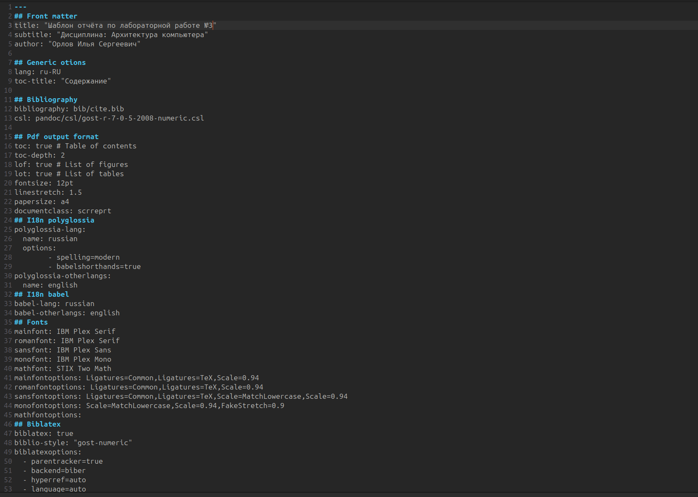

---
## Front matter
title: "Отчёт по лабораторной работе №3"
subtitle: "Дисциплина: Архитектура компьютера"
author: "Орлов Илья Сергеевич"

## Generic otions
lang: ru-RU
toc-title: "Содержание"

## Bibliography
bibliography: bib/cite.bib
csl: pandoc/csl/gost-r-7-0-5-2008-numeric.csl

## Pdf output format
toc: true # Table of contents
toc-depth: 2
lof: true # List of figures
lot: true # List of tables
fontsize: 12pt
linestretch: 1.5
papersize: a4
documentclass: scrreprt
## I18n polyglossia
polyglossia-lang:
  name: russian
  options:
	- spelling=modern
	- babelshorthands=true
polyglossia-otherlangs:
  name: english
## I18n babel
babel-lang: russian
babel-otherlangs: english
## Fonts
mainfont: IBM Plex Serif
romanfont: IBM Plex Serif
sansfont: IBM Plex Sans
monofont: IBM Plex Mono
mathfont: STIX Two Math
mainfontoptions: Ligatures=Common,Ligatures=TeX,Scale=0.94
romanfontoptions: Ligatures=Common,Ligatures=TeX,Scale=0.94
sansfontoptions: Ligatures=Common,Ligatures=TeX,Scale=MatchLowercase,Scale=0.94
monofontoptions: Scale=MatchLowercase,Scale=0.94,FakeStretch=0.9
mathfontoptions:
## Biblatex
biblatex: true
biblio-style: "gost-numeric"
biblatexoptions:
  - parentracker=true
  - backend=biber
  - hyperref=auto
  - language=auto
  - autolang=other*
  - citestyle=gost-numeric
## Pandoc-crossref LaTeX customization
figureTitle: "Рис."
tableTitle: "Таблица"
listingTitle: "Листинг"
lofTitle: "Список иллюстраций"
lotTitle: "Список таблиц"
lolTitle: "Листинги"
## Misc options
indent: true
header-includes:
  - \usepackage{indentfirst}
  - \usepackage{float} # keep figures where there are in the text
  - \floatplacement{figure}{H} # keep figures where there are in the text
---

# Цель работы

Целью данной лабораторной работы является освоение процедуры оформления отчетов с помощью легковесного языка разметки Markdown.

# Задание

- Установка необходимого ПО
- Заполнение отчета по выполнению лабораторной работы №4 с помощью языка разметки Markdown
- Задание для самостоятельной работы

# Теоретическое введение

Markdown — облегчённый язык разметки, созданный с целью обозначения форматирования в простом тексте, с максимальным сохранением его читаемости человеком, и пригодный для машинного преобразования в языки для продвинутых публикаций (HTML, Rich Text и других). 

# Выполнение лабораторной работы

# TexLive и pandoc

{width=70%}

# Обновляю локальный репозиторий 

{width=70%}

# Перехожу в каталог с шаблоном отчета по лабораторной работе № 3 и компилирую 

{width=70%}

# Удаляю полученные файлы

{width=70%}

# Открываю файл report.md и редактирую его, потом отправляю на Github

{width=70%}

# Задание для самостоятельной работы 

Аналогично выполнению отчета по текующей лабораторной работе, я выполняю отчет в markdown и по второй лабораторной работе, для этого перехожу в директорию 2 лабораторной работы и готовлю отчет

# Выводы

В результате выполнения данной лабораторной работы я освоил процедуры оформления отчетов с помощью легковесного языка разметки Markdown.

# Список литературы

1. [Курс на ТУИС](https://esystem.rudn.ru/course/view.php?id=112)
2. [Лабораторная работа №3](https://esystem.rudn.ru/pluginfile.php/2089083/mod_resource/content/0/%D0%9B%D0%B0%D0%B1%D0%BE%D1%80%D0%B0%D1%82%D0%BE%D1%80%D0%BD%D0%B0%D1%8F%20%D1%80%D0%B0%D0%B1%D0%BE%D1%82%D0%B0%20%E2%84%963.%20%D0%AF%D0%B7%D1%8B%D0%BA%20%D1%80%D0%B0%D0%B7%D0%BC%D0%B5%D1%82%D0%BA%D0%B8%20.pdf)
3. [Пример выполнения лабораторной работы](https://github.com/evdvorkina/study_2022-2023_arh-pc/blob/master/labs/lab04/report/%D0%9B04_%D0%94%D0%B2%D0%BE%D1%80%D0%BA%D0%B8%D0%BD%D0%B0_%D0%BE%D1%82%D1%87%D0%B5%D1%82.md?plain=1)
